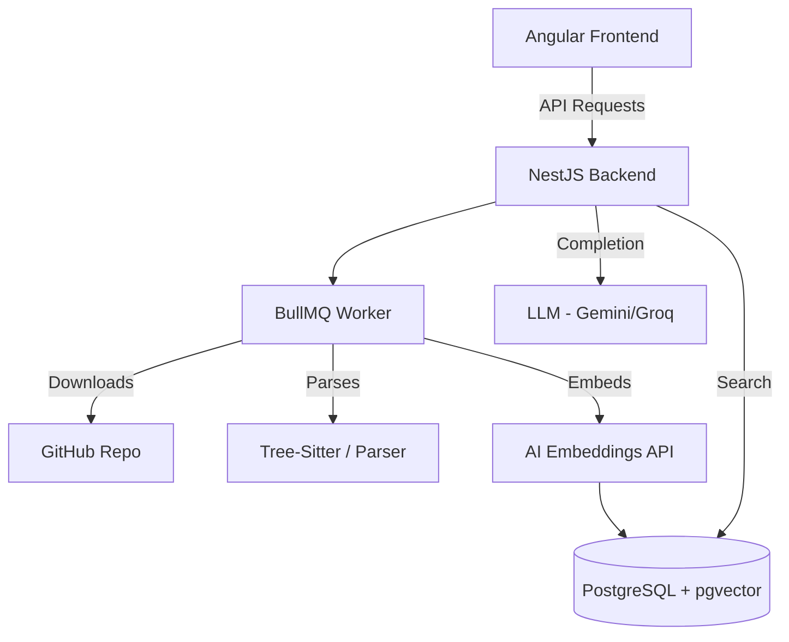

# DevStack — Repo Intelligence 🚀

**DevStack** is an AI-powered codebase intelligence platform. It enables developers to explore and understand complex GitHub repositories using RAG-powered chat, structural code parsing, and interactive visual mapping.

---

## 🌟 Features

- **Codebase Indexing:** Paste any public GitHub repo URL and let DevStack index its structure.
- **RAG-Powered Chat:** Ask architecture-level questions and get grounded answers.
- **File Citations:** Every AI response is linked to the relevant source files.
- **Interactive File Preview:** Inspect code directly within the chat interface.
- **Structural Awareness:** Understands classes, functions, and modules, not just raw text.

---

## 🏗️ Project Architecture



---

## 🛠️ Tech Stack

### Frontend
- **Framework:** Angular 17+ (Standalone Components)
- **Styling:** Tailwind CSS
- **Icons:** Lucide Angular

### Backend
- **Framework:** NestJS
- **Database:** PostgreSQL + `pgvector`
- **Background Tasks:** BullMQ + Redis
- **ORM:** TypeORM

---

## 📂 Repository Structure

- `/frontend`: Angular client application.
- `/backend`: NestJS server application.
- `/backend/database`: SQL schemas and migration files.

---

## 🚀 Getting Started

### Prerequisites

- Node.js (v18+)
- PostgreSQL with `pgvector` extension
- Redis (for BullMQ)

### Setup & Running

You can run both the frontend and backend with a single command from the project root.

1.  **Clone the repo:**
    ```bash
    git clone https://github.com/TarunyaProgrammer/DevStack-RepoIntelligence.git
    cd DevStack-RepoIntelligence
    ```

2.  **Install dependencies:**
    ```bash
    npm run setup
    ```

3.  **Configure environment:**
    Update `backend/.env` with your database and AI API credentials.

4.  **Run in Development Mode:**
    ```bash
    npm run dev
    ```

---

## 📜 Commands

- `npm run setup`: Installs dependencies for root, frontend, and backend.
- `npm run dev`: Starts both frontend and backend concurrently.
- `npm run start:backend`: Starts only the backend.
- `npm run start:frontend`: Starts only the frontend.

---

## 🤝 Contributing

We welcome contributions! Please see [CONTRIBUTING.md](CONTRIBUTING.md) for guidelines.

## 📄 License

This project is licensed under the MIT License - see the [LICENSE](LICENSE) file for details.

## 👥 Contributors

See [CONTRIBUTORS.md](CONTRIBUTORS.md) for a list of everyone who has helped build DevStack.
